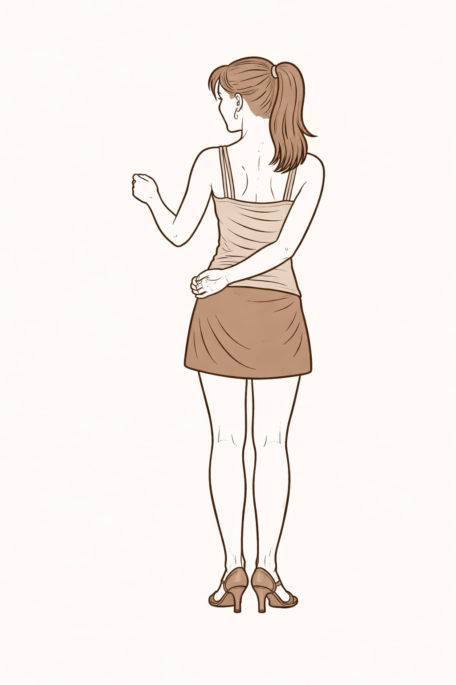

Hammerlock is the position where the follower has the (often left) hand behind her back, where the leader grabs the hand on the other side.

## Variants

There are a variety of ways to get into the hammerlock and to get out of it. See the children pages for variants.
